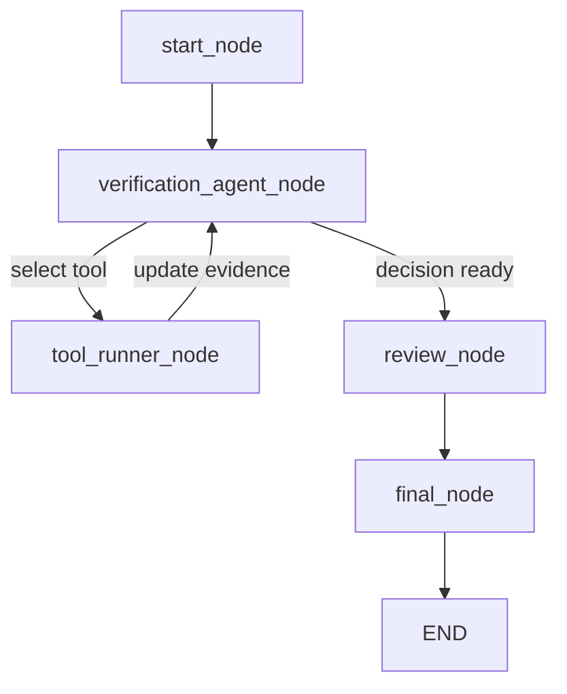

# Project for the BINARY v2 Hackathon
- Participation Ticket:


## MAR Certificate Fraud Detection

A beginner-friendly agentic AI app for MAR certificate verification and fraud analysis. MAR(Mandatory Additional Requirements) are required in colleges and universities to meet a certain complementary credit points which comprises of external certifications and rewards. Students try to cheat their way in this for submission of these MAR points therefore this project detects the fake ones (calculates risk score and decides whether their certificates requires admin review or not through an agentic workflow).

This project uses:

- `LangGraph` for the workflow
- `LangChain @tool` tools for verification actions
- `OpenAI` for tool selection and explanation
- `FastAPI` for backend APIs

This README reflects the current implemented system.

---

## Overview

For each uploaded certificate, the backend:

1. stores the file locally,
2. starts an agentic verification workflow,
3. lets the LLM choose the next verification tool,
4. runs tools until enough proof is collected,
5. assigns a review status,
6. generates a final explanation,
7. stores the result for later API access.

The LLM is bounded to a fixed tool set. It does not run arbitrary verification logic by itself.

---

## Current Graph Workflow

The active graph uses only five workflow nodes:

- `start_node`
- `verification_agent_node`
- `tool_runner_node`
- `review_node`
- `final_node`

### Agentic Workflow Diagram



### What Each Node Does

#### `start_node`
- validates that the uploaded file exists
- initializes workflow logs and state

#### `verification_agent_node`
- binds the OpenAI model to the fixed tool set
- decides which verification tool should run next
- falls back to deterministic planning if OpenAI is unavailable

#### `tool_runner_node`
- runs the selected tool
- writes the tool output back into workflow state
- records the tool run for traceability

#### `review_node`
- converts the final decision into review status

Current review outputs:
- `admin_review_required`
- `likely_valid_pending_human_confirmation`

#### `final_node`
- generates the final explanation
- finishes the workflow

---

## LangChain Tool Set

The active verification tools are defined in [tool_service.py](d:/Projects/MAR-Fraud-Detection/app/services/tool_service.py).

These are real `@tool`-decorated functions.

### Current tools

#### `document_type_tool`
Checks whether the uploaded file looks like a certificate.

#### `ocr_tool`
Extracts OCR text and basic fields.

#### `qr_tool`
Checks for QR data.

#### `duplicate_check_tool`
Checks whether the same file has already been submitted.

#### `issuer_verification_tool`
Runs issuer-specific verification logic.

Current issuer adapter:
- IEEE adapter

#### `rule_check_tool`
Validates MAR rules against extracted evidence.

#### `risk_score_tool`
Calculates the fraud risk score.

#### `decision_tool`
Produces the final route:
- `admin_review`
- `likely_valid`

---

## IEEE Issuer Adapter

The project now includes an issuer-specific verification adapter for IEEE-style certificates.

Files:
- [base.py](d:/Projects/MAR-Fraud-Detection/app/services/adapters/base.py)
- [ieee_adapter.py](d:/Projects/MAR-Fraud-Detection/app/services/adapters/ieee_adapter.py)

### What the IEEE adapter does

- checks whether the certificate looks like an IEEE certificate
- checks whether the QR points to a trusted IEEE domain
- performs a simple IEEE template check
- returns issuer-verification results into workflow state

This gives stronger verification than only generic OCR and keyword checks.

---

## How The Agentic Flow Works

For every uploaded document:

1. `start_node` validates the file.
2. `verification_agent_node` checks current evidence.
3. The LLM chooses the next best verification tool.
4. `tool_runner_node` executes that tool.
5. The workflow state is updated with new evidence.
6. Control returns to `verification_agent_node`.
7. The loop continues until there is enough proof to make a final decision.
8. `review_node` converts the decision into review status.
9. `final_node` generates the explanation and finishes the run.

This means the system is:

- agentic in tool selection
- bounded to a fixed verification tool set
- auditable through stored state and timeline

---

## Backend API Workflow

The backend is intentionally simple and exposes only the main working routes.

### Backend API Diagram

```mermaid
flowchart TD
    A[Client Upload] --> B[POST /api/submissions/upload]
    B --> C[Save file to app/data/uploads]
    C --> D[Run process_submission]
    D --> E[LangGraph workflow]
    E --> F[Store final result]
    F --> G[Return submission detail]

    H[GET /api/submissions] --> I[List recent submissions]
    J[GET /api/submissions/{id}] --> K[Return full detail]
    L[GET /api/workflow/tools] --> M[Return fixed tool catalog]
    N[GET /api/dashboard/summary] --> O[Return aggregate metrics]
```

---

## Current Active API Routes

### `GET /api/health`
Checks whether the backend is running.

Example:

```json
{
  "status": "ok"
}
```

### `GET /api/workflow/tools`
Returns the fixed LangChain tool set available to the planner.

### `POST /api/submissions/upload`
Uploads and processes a single certificate file through the full workflow.

Form fields:
- `file`
- `student_id`
- `student_name`
- `claimed_category`
- `claimed_points`

Returns:
- submission id
- decision
- review status
- risk score
- explanation
- full state
- timeline
- alerts

### `GET /api/submissions`
Returns recent processed submissions.

### `GET /api/submissions/{submission_id}`
Returns one processed submission in full detail.

### `GET /api/dashboard/summary`
Returns compact dashboard metrics:
- `total_submissions`
- `average_risk_score`
- `rule_validation_rate`
- `duplicate_rejections`
- `admin_review_required`
- `likely_valid_pending_human_confirmation`

---

## Where File Upload Happens

The upload enters here:

- `POST /api/submissions/upload`

The file is saved locally in:

- `app/data/uploads/`

The backend stores it with a generated UUID filename and then passes the saved local path into the workflow.

So:

- original file name is kept for display
- saved local file path is used for OCR, QR, duplicate check, issuer verification, and scoring

---

## Important Files

### Graph and State
- [graph.py](d:/Projects/MAR-Fraud-Detection/app/graph.py)
- [state.py](d:/Projects/MAR-Fraud-Detection/app/state.py)

### Active Nodes
- [start_node.py](d:/Projects/MAR-Fraud-Detection/app/nodes/start_node.py)
- [verification_agent_node.py](d:/Projects/MAR-Fraud-Detection/app/nodes/verification_agent_node.py)
- [tool_runner_node.py](d:/Projects/MAR-Fraud-Detection/app/nodes/tool_runner_node.py)
- [review_node.py](d:/Projects/MAR-Fraud-Detection/app/nodes/review_node.py)
- [final_node.py](d:/Projects/MAR-Fraud-Detection/app/nodes/final_node.py)

### Services
- [tool_service.py](d:/Projects/MAR-Fraud-Detection/app/services/tool_service.py)
- [llm_service.py](d:/Projects/MAR-Fraud-Detection/app/services/llm_service.py)
- [workflow_service.py](d:/Projects/MAR-Fraud-Detection/app/services/workflow_service.py)
- [repository.py](d:/Projects/MAR-Fraud-Detection/app/services/repository.py)
- [scoring_service.py](d:/Projects/MAR-Fraud-Detection/app/services/scoring_service.py)
- [rules_service.py](d:/Projects/MAR-Fraud-Detection/app/services/rules_service.py)

### Adapter Files
- [base.py](d:/Projects/MAR-Fraud-Detection/app/services/adapters/base.py)
- [ieee_adapter.py](d:/Projects/MAR-Fraud-Detection/app/services/adapters/ieee_adapter.py)

### Backend
- [main.py](d:/Projects/MAR-Fraud-Detection/backend/main.py)
- [schemas.py](d:/Projects/MAR-Fraud-Detection/backend/schemas.py)

---

## Verification Stack

### OCR
- `pypdf` for direct PDF text extraction
- `PaddleOCR` fallback

### QR Check
- `OpenCV`
- `pyzbar`

### Duplicate Detection
- SHA-256 file hash
- local JSON hash store

### Rule Validation
- local JSON MAR rules

### Issuer Verification
- IEEE adapter

### LLM Usage
- tool selection in the planner
- document review support
- rule review support
- final decision review
- final explanation generation

---

## Setup

### 1. Create virtual environment

```powershell
py -3 -m venv .venv
```

### 2. Activate it

```powershell
.venv\Scripts\activate
```

### 3. Install dependencies

```powershell
uv pip install --python .venv\Scripts\python.exe -r requirements.txt
```

### 4. Create `.env`

```env
OPENAI_API_KEY=your_openai_api_key_here
```

---

## Run The Backend

```powershell
.venv\Scripts\python.exe -m uvicorn backend.main:app --reload
```

Swagger docs:

```text
http://127.0.0.1:8000/docs
```

---

## API Smoke Test

Run:

```powershell
.venv\Scripts\python.exe tests\test_api.py
```

This checks:

1. upload a sample certificate
2. process it through the agentic workflow
3. fetch the stored submission
4. fetch the tool catalog
5. fetch the dashboard summary

---

## Judge Demo Flow

Suggested demo:

1. Open `/docs`
2. Call `GET /api/workflow/tools`
3. Show the fixed tool set
4. Call `POST /api/submissions/upload`
5. Upload a sample certificate
6. Show:
   - decision
   - review status
   - risk score
   - explanation
   - timeline
   - alerts
7. Call `GET /api/dashboard/summary`
8. Show the aggregate summary

This demonstrates:

- bounded agentic verification
- tool-driven checking
- issuer-specific verification support
- backend API readiness for dashboard integration

---

## Current Limitations

- the planner is agentic, but the tool set is intentionally fixed
- document classification is still heuristic under the tool layer
- duplicate detection is exact file-hash based
- OCR field extraction is still basic
- IEEE live verification fetch is still a placeholder
- some older node files may remain as compatibility shims
- OpenAI calls may fall back to deterministic logic if unavailable

---

## Summary

This project is now a beginner-friendly backend-only agentic fraud analysis system with:

- a LangGraph planner-and-tool-runner loop
- LangChain `@tool` verification tools
- issuer-specific verification through an IEEE adapter
- FastAPI routes for upload, results, and dashboard summary
- local storage for uploaded files and processed results
